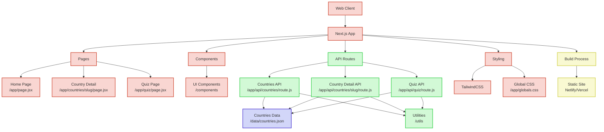

# CountryHub

Your go-to Next.js app for exploring world nations through beautiful flags, emblems, and fascinating facts.

## Demo

- [Frontend](https://country-hub-jd.vercel.app/)
- [Backend](https://country-hub-jd.vercel.app/api/countries)

## Project Architecture


[Learn more](./architecture-diagram.md) about the architecture diagram. ([Spanish](./architecture-diagram-es.md))

## Features

- **Country List**: Browse all countries with their flags and basic information
- **Country Details**: View detailed information about each country including:
  - Flag and national emblems
  - Capital city
  - Currency
  - Population
  - Additional country facts
- **Interactive Quiz**: Test your knowledge about countries with a built-in quiz feature

## Technologies Used

- **Next.js 13**: React framework with App Router
- **React**: UI library
- **Tailwind CSS**: Utility-first CSS framework for styling
- **Next.js Image Component**: For optimized image loading and display
- **SVG Fallback Images**: Dynamic generation of placeholder images

## Getting Started

### Prerequisites

- Node.js 16.8.0 or later
- npm or yarn

### Installation

1. Clone the repository:
```bash
git clone <repository-url>
cd flags
```

2. Install dependencies:
```bash
npm install
# or
yarn install
```

3. Run the development server:
```bash
npm run dev
# or
yarn dev
```

4. Open [http://localhost:3000](http://localhost:3000) in your browser to see the application.

## Project Structure

- `/app`: Next.js App Router pages and layouts
  - `/api`: API routes for serving country data
  - `/countries`: Dynamic routes for country details
  - `/quiz`: Quiz feature pages
- `/components`: Reusable React components
- `/data`: JSON data files for countries
- `/lib`: Library functions for data fetching
- `/utils`: Utility functions
- `/public`: Static assets

## API Routes

- `GET /api/countries`: Returns a list of all countries with basic information
- `GET /api/countries/[slug]`: Returns detailed information about a specific country
- `GET /api/quiz/random`: Returns a random quiz question
- `GET /api/quiz/[id]`: Returns a specific quiz question
- `GET /api/quiz/answer/[id]`: Validates an answer for a specific quiz question

## Building for Production

```bash
npm run build
# or
yarn build
```

Then start the production server:

```bash
npm run start
# or
yarn start
```

## Additional Scripts

- `npm run lint`: Run ESLint to check code quality
- `npm run format`: Format code using Prettier
- `npm run clean`: Clean build artifacts and reinstall dependencies

## License

This project is licensed under the MIT License - see the LICENSE file for details.

## Acknowledgements

- Country data sourced from various public domain sources
- Flag and emblem images from Wikimedia Commons
- Main Source: [Sample-APIs](https://api.sampleapis.com)
