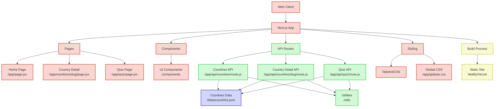

# CountryHub Project Architecture

## Architecture Diagram

## Diagram Explanation

### Frontend
- **Web Client**: The user's browser accessing the application
- **Next.js App**: The main framework handling both frontend and backend
- **Pages**: React components representing complete routes
  - **Home Page**: Lists all countries (`/app/page.jsx`)
  - **Country Detail**: Shows details of a specific country (`/app/countries/slug/page.jsx`)
  - **Quiz Page**: Country quiz page (`/app/quiz/page.jsx`)
- **Components**: Reusable UI elements
- **Styling**: Styling system
  - **TailwindCSS**: CSS utility framework
  - **Global CSS**: Application global styles

### Backend (Next.js API Routes)
- **API Routes**: Next.js API endpoints system
  - **Countries API**: Returns list of countries (`/app/api/countries/route.js`)
  - **Country Detail API**: Returns details of a specific country (`/app/api/countries/slug/route.js`)
  - **Quiz API**: Handles quiz logic (`/app/api/quiz/route.js`)
- **Utilities**: Helper functions for data processing

### Data
- **Countries Data**: JSON file with all country data (`/data/countries.json`)

### Deployment
- **Build Process**: Next.js build process
- **Static Site**: Static site deployed on Netlify or Vercel

## Data Flow

1. The client requests a page (e.g., the list of countries)
2. Next.js handles the request through its routing system
3. The page component makes a request to the internal API
4. The API Route processes the request, accessing the JSON data
5. The data is transformed as needed using utilities
6. The response is returned to the page component
7. The component renders the data and is displayed to the user

This flow leverages Next.js's full-stack architecture, where both frontend and backend are integrated into a single framework.
